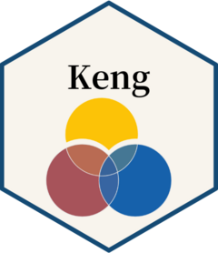

<!-- README.md is generated from README.Rmd. Please edit that file -->

```{r, include = FALSE}
knitr::opts_chunk$set(
  collapse = TRUE,
  comment = "#>",
  fig.path = "man/figures/README-",
  out.width = "100%"
)
```

# Keng 

<!-- badges: start -->
[](https://CRAN.R-project.org/package=Keng)
<!-- badges: end -->

`Keng` is the abbreviation of "Knock Errors off Nice Guesses." Hope the functions and data gathered in the `Keng` package help to ease your life.

## Installation

You can install the development version of `Keng` from [GitHub](https://github.com/) with:

``` r
# install pak if it is not installed
if (!requireNamespace("pak", quietly = TRUE)) {
  install.packages("pak")
}

# install the developing version of Keng from GitHub
pak::pak("qyaozh/Keng")
```

## Load

Before using the `Keng` package, load it using the `library()` function.

```{r library}
library(Keng)
```

## List of contents

Here is a list of the data and functions gathered in the `Keng` package. Their usages are detailed in the documentation.

### Data

Four data sets (i.e., `depress`, `depress1`, `depress2`, `depress3`) from the D (depression) research.

Four data sets (i.e., `well`, `well1`, `well2`, `well3`) from the W (well-being) research.

### Variable transformation

`Scale()` could standardize the mean and standard deviation of `x` (including transforming it to its z-score). To change the origin of `x`, just change its mean.

`divide()` could divide a vector into three groups, using the criterion of 1 SD, or proportions like 0.27.

### Pearson's r

`cut_r()` gives you the cut-off values of Pearson's r at the significance levels of p = 0.1, 0.05, 0.01, and 0.001 with known sample size n.

`test_r()` tests the significance and compute the post-hoc power of r with known sample size n.

`powered_r()` conducts post-hoc power analysis with known sample size n. 

`power_r()` conducts a priori power analysis and plan the sample size for r. 

### The linear model

`compare_lm()` compares `lm()`'s fitted outputs using PRE, R^2^, f^2^, and post-hoc power.

`calc_PRE()` calculates PRE from partial correlation, Cohen's f, or f_squared.

`powered_lm()` conducts post-hoc power analysis with known sample size n.

`power_lm()` conducts a priori power analysis and plans the sample size for one or a set of predictors in regression analysis.

### The `Keng_power` class

`power_r()` and `power_lm()` return the `Keng_power` class, which has `print()` and `plot()` methods.

`print()` prints primary but not all contents of the `Keng_power` class.

`plot()` plots the power against sample size for the `Keng_power` class.

### pick_* tools

`pick_sl()` and `pick_dcb()` have been added to randomly pick numbers for Chinese 
Super Lotto and Double Color Balls.

### Assess OBE-based course objective achievement

`assess_coa()` calculates course objective achievement based on students' grades per session, weights of each session, and weights of course objectives within each session.
